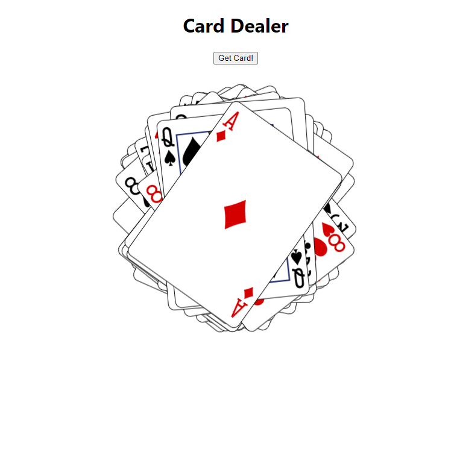

# Deck

This is a page where we will discard the cards in a deck, which will reset when it runs out of cards.

## Table of contents

- [Overview](#overview)
  - [The challenge](#the-challenge)
  - [Screenshot](#screenshot)
- [My process](#my-process)
  - [Built with](#built-with)
  - [What I learned](#what-i-learned)
- [Author](#author)

## Overview

### The challenge

Users should be able to:

- Push the "get card" button to get cards
- The next card will always have a random position
- When all 52 cards are all drawn, it will alert "No card remaining"

### Screenshot



## My process

### Built with

- Semantic HTML5 markup
- CSS custom properties
- Flexbox
- Javascript
- REACTJS

### What I learned

```js
let angle = Math.random() * 90 - 45;
let xPos = Math.random() * 40 - 20;
let yPos = Math.random() * 40 - 20;
this._transform = `translate(${xPos}px, ${yPos}px) rotate(${angle}deg)`;
```

## Author

- Frontend Mentor - [@manhtran1611](https://www.frontendmentor.io/profile/manhtran1611)
- Facebook - [@manhtranduc1611](https://www.facebook.com/manhtranduc1611)
